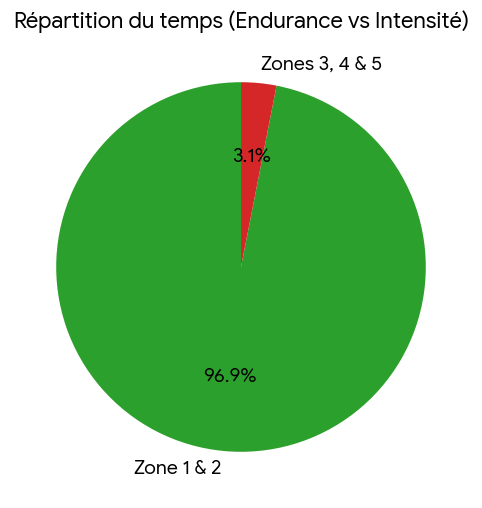
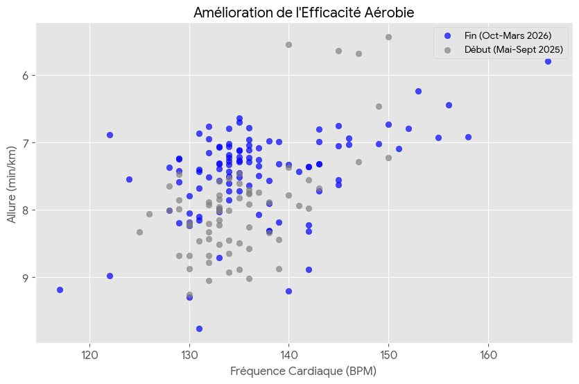
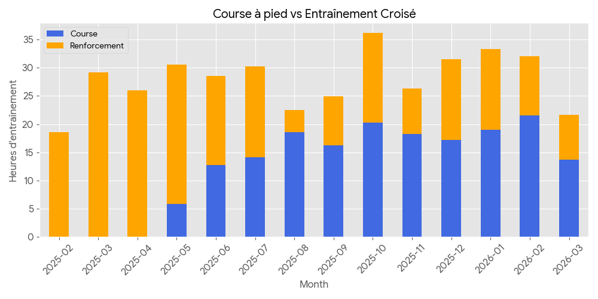
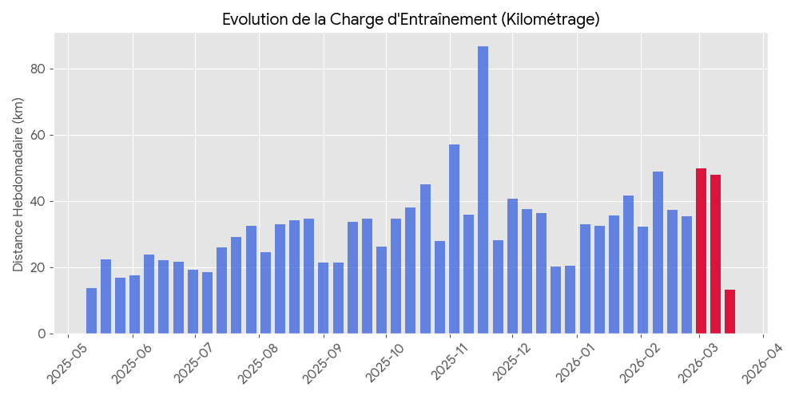

In my previous article, I told you the story of my year preparing for the Nancy half-marathon and my last-minute injury. Today, we remove the emotion and look strictly at the cold, hard math.

I exported all my activities from my Garmin watch (paired with my Polar H10 chest strap) into a raw file. The analysis reveals exactly why I progressed so much, but also why I ultimately crashed.

Here are 5 charts that summarize almost 400 hours of sweat.

## 1. The Foundation of the Temple: The 80/20 Rule

We often hear that you have to run slow to run fast. This is the famous rule of fundamental endurance.

With a resting heart rate of 46 BPM and a measured maximum of 196 BPM (Karvonen method), my "Zone 2" extends up to 152 BPM. The chart above is indisputable: **96.7% of my running time** was spent in this green zone. I built a massive diesel engine without generating unnecessary lactic fatigue.

## 2. Proof of Progress: Aerobic Efficiency

Increasing your VO2Max from 40 to 44 is an abstract number. But what actually happens on the ground?

This scatter plot compares all my runs between the beginning of my prep (in gray) and the end of my prep (in blue). Here we see the pure definition of aerobic progress: **for the exact same heart rate (e.g., 140 BPM), my running speed drastically increased**. The blue cloud is shifted upwards (faster paces) compared to the gray cloud, proving my heart became much more efficient at delivering oxygen to my muscles.

## 3. The Double-Edged Sword: Running VS Cross-Training

Many runners think only mileage matters. Analyzing my total volume reveals a different reality: I was a hardcore "Cross-Training" addict (at *[Le Punch](https://punchnancy.fr/)* gym).

Over a year, I ran for about **177 hours**... but I also spent **208 hours** doing strength training, fitness, and pure cardio! That’s a staggering total of over 385 hours of sports.
This massive volume built a true muscular armor, but it also drained my nervous energy and recovery capacity without me realizing it.

## 4. Chronicle of an Injury Foretold: Mileage Load

We now reach the most painful chart: the error.

In blue, the slow and cautious increase in my mileage over the months, orchestrated by my coach. In red, March 2026.
Hindsight is always 20/20.
I believe what caused my injury was a combination of:

* increased volume per run
* increased pace
* switching to a pair of high-performance shoes

My posterior tibial tendon said stop. The mechanics gave out.

## 5. "Fun Data" for Perspective

To end on a lighter note, I compiled the absurd totals of my athletic year. Since May 2025, I have:
* 🔥 **Burned over 247,000 kilocalories.** That is the energy equivalent of about **120 entire pizzas** (or 1,200 pints of beer for post-race hydration!).
* 🏔️ **Climbed 10,654 meters of elevation gain.** That's much higher than the summit of Mount Everest (8,848m), or the equivalent of climbing the Eiffel Tower stairs 32 times.

Analyzing this data is therapeutic. The load error is mathematically obvious, which proves it is avoidable in the future. My engine is massive and ready for what's next.

We save the CSV file. And we go again for the 2027 edition.