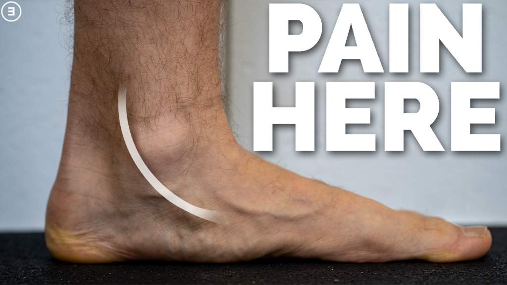

L'histoire commence souvent par un défi entre amis.

Je pratique le sport depuis des années à la salle *Le Punch* (fitness, cross-training, taekwondo, kickboxing...). L'année dernière, mes amis d'entraînement (Léa, Mathias, Franck, Phillippe, Antoine) ont bouclé le semi-marathon de Nancy 2025 avec d'excellents chronos, passant pour certains sous la barre mythique des deux heures. Il n'en fallait pas plus pour me dire : *"Pourquoi pas moi ?"*.

J'ai commencé à courir seul en mai 2025. Très vite, face à la complexité de l'entraînement d'endurance, j'ai fait appel à Mortimer DUBOIS (alias Morty) pour me coacher. L'objectif était clair : le semi de Nancy, le 29 mars 2026.

Voici l'analyse de cette année de préparation, des datas de mon "moteur" jusqu'au bug mécanique final.

## 1. Le Moteur : Construction d'un cœur de diesel

En tant que passionné de data, j'ai mesuré chaque battement de cette préparation, équipé de ma montre Garmin et de ma ceinture pectorale Polar H10 (indispensable pour avoir des données fiables à haute intensité).

Les résultats d'une année d'entraînement structuré sont physiologiquement fascinants :

* **La VO2Max :** Je suis passé d'une estimation de 40 à **44 ml/kg/min**. Une augmentation nette de 10% de mon "moteur" aérobie en un an.
* **Le spectre cardiaque :** J'ai découvert que j'avais une fréquence cardiaque au repos de **46 BPM** (la fameuse bradycardie du sportif) pour une fréquence maximale mesurée sur piste à **196 BPM**. Une amplitude de 150 battements qui me donne une marge de manœuvre énorme.

En extrayant mes données Garmin (plus de 166 heures de course analysées), la répartition de mon effort est sans appel : **96,7 % de mon volume s'est fait en Endurance Fondamentale** (Zone 1 et 2, sous les 152 BPM). J'ai construit une base aérobie gigantesque, sans m'épuiser inutilement sur chaque sortie.

## 2. La Stratégie : Pacing et Nutrition millimétrés

Grâce à mon record récent sur 10 km (La Ronde Hivernale en 58:03, soit 5:48/km), nous avions calibré une allure de course à **6:10/km** pour le semi. À cette allure, mon cardio se cale confortablement à 145 BPM. J'étais exactement là où il fallait être : à la limite haute de la Zone 2, capable de brûler des graisses sans accumuler d'acide lactique.

Pour l'énergie, j'avais développé une stratégie "métronome" basée sur la nutrition Näak :

* **Énergie solide :** Un gel de 25g de glucides tous les 4,2 km.
* **Hydratation :** 10 prises régulières (tous les 1,4 km) de boisson isotonique diluée pour ménager l'estomac, accompagnées d'une flasque d'eau claire de 500ml pour faciliter l'assimilation des gels.

Sur le papier, j'étais programmé pour terminer autour de 2h10 avec un confort optimal.

## 3. Le Bug Système : L'erreur de charge

Puis, la mécanique a lâché.

Début mars, j'ai réalisé une grosse sortie test de 21 km. Le cardio allait parfaitement bien, mais les tendons, eux, ont commencé à siffler. J'ai ressenti une première gêne.
C'est ici que j'ai fait l'erreur classique du coureur amateur : j'ai regardé mon plan d'entraînement au lieu d'écouter mon corps. J'ai continué à accumuler de la charge, ajoutant une grosse séance de 17 km avec des blocs d'allure, pour finalement exploser en plein vol le mercredi 18 mars lors d'une séance de 30 minutes au seuil.

Le lendemain matin : impossible de poser le pied par terre. Consultation en urgence (kiné et médecin du sport en moins de 24h). Le diagnostic est tombé : **Tendinopathie du Tibial Postérieur**. Un tendon enflammé par la répétition des chocs et la fatigue cumulée.

Verdict : pas de semi-marathon en 2026.

## 4. Reboot : Objectif 2027

S'investir pendant un an et rater la ligne de départ à 10 jours de l'échéance est frustrant. Mais la data nous apprend aussi à relativiser. Le travail physiologique n'est pas perdu. Le cœur et les poumons ne s'évaporent pas.

J'ai décidé de tirer le meilleur de cette situation. Mon médecin m'a autorisé à maintenir une activité tant que la douleur reste sous les 4/10 (le fameux protocole de Silbernagel).
Je passe donc en mode "entraînement croisé" :

* **Le vélo :** Pour maintenir ma VO2Max intacte sans aucun choc pour mes tendons.
* **Le renforcement musculaire :** Je continue mes cours au *Punch* et ma rééducation avec le kiné pour me forger des jambes en titane.

L'objectif initial était de finir le semi en 2026. L'objectif a simplement été mis à jour : **Nancy 2027, et cette fois, on ira chercher le "Sub-2h"**.

Les datas sont sauvegardées. Le système redémarre. À l'année prochaine !
